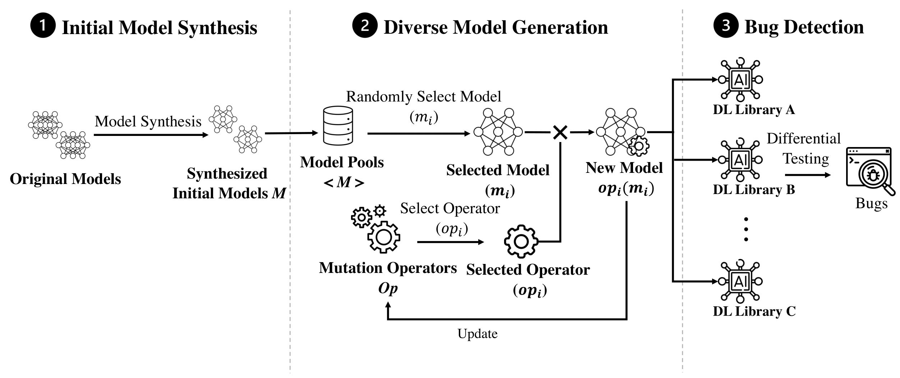

# MEMO: Coverage-guided Model Generation For Deep Learning Library Testing

## Overview

MEMO is a coverage-guided deep learning (DL) library testing tool.



## Experiments

We share our experiment results in `./evaluations` directory. We provide three codebooks for [RQ1](./MEMO/evaluations/RQ1.ipynb), [RQ3][./MEMO/evaluations/RQ3_ModelSynthesis.ipynb], and [RQ4][./MEMO/evaluations/RQ4-Ablation.ipynb] to analyze these results.

## Reproduction

We provide our implementation of MEMO in `./implementations` directory. To use them, a few configurations steps are required.

### DL Models

We use 10 published DL models as the seed model for model generation. These DL models can be accessed through [here](https://drive.google.com/drive/folders/1d6rk80UvqcRtc6voN3jaux3wTbmUAYaI?usp=sharing). After downloading them, create a directory named `origin_model`  under the  `./data/` directory to save these models.

### Environment

We use Anaconda3 to manage our environment. Please run the following commands to create the main environment

```
conda create -n memo python=3.7
pip install tensorflow-gpu==2.7.0 keras==2.7.0 notebook
pip install -r requirements
```

We further build several conda environment for model conversion and testing different libraries.

```
# build model conversion environment
conda create -n model_convertor python=3.6
pip install tensorflow-gpu==2.6
pip install tf2onnx
pip install keras==2.6.0
```

For tensorflow environment, run the following command to install tensorflow from source

```
git clone https://github.com/tensorflow/tensorflow.git
cd tensorflow/
git checkout 76f23e7975ce2bf81721673f20656530e1e609ac
pip install numpy
pip install keras_preprocessing
conda install bazel=3.7.2
```

Then type `cd tensorflow && ./configure`, to configure tensorflow with `--coverage` option. After configuring tensorflow with `--coverage` option, run following commands to compile tensorflow

```
cd tensorflow
bazel build --copt=-coverage --linkopt=-lgcov --verbose_failures --spawn_strategy=standalone --config=opt --config=cuda --jobs=24 //tensorflow/tools/pip_package:build_pip_package
```

Then build tensorflow's python environment:

```
# build tensorflow environment
conda create -n tensorflow python=3.6
conda install cudnn=8.2.1 -c anaconda
compile tensorflow (76f23e7975c) from source to collect code coverage
pip install keras==2.8.0
pip install -r requirements
```

Run the following commands to build pytorch and onnx's environment:
```
# build pytorch and onnx environment
conda create -n pytorch python=3.6
pip install -r requirements
pip install onnx2pytorch onnx
pip install pytorch==1.10.0 onnxruntime-gpu==1.10.0

```

After configuring the conda environment, replace the `/xxx` annotation on files under the `./implementation/config` to the actual path (e.g., replace `python_prefix = /xxx/anaconda3/envs/` in `memo.conf` with `python_prefix = /root/anaconda3/envs/`, where `/root` is the main directory we store `anaconda3`). 

To collect code coverage of tensorflow, we also need replace the `/xxx` under `tensorflow_modules_meta.json`, `tensorflow_related_modules.json`, and `tf_file_br.json` with the actual directory we used to compile tensorflow.

## Run

`cd implementations/run`

Run `synthesize_model.sh` to synthesize initial models, then run `run_memo.sh` to execute MEMO. 

Run `run_old_mutation.sh`, `run_random_selection.sh` to run MEMO with old mutation operators or without our MCMC-based search algorithm.


